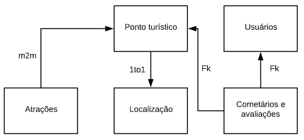

#[Criando poderosas API's RESTful com Django Rest Framework](www.udemy.com/course/apis-restful-com-django-rest-framework/)

_requirements: django, djangorestframework_

## Do que o curso se trata?
O Django Rest Framework utiliza-se do framework bastante conhecido, o Django (sim, são diferentes), para que haja a aplicação da API juntamente
com todas a funcionalidades do framework Django.

## Fluxo do aplicativo


### Passos a ser seguidos
* Procedimento normal de um início de projeto Django
    * Cria uma venv
    * Pip install requirements
    * django-admin startproject nome_do_projeto .
    * python manage.py makemigrations
    * python manage.py migrate
* Adiciona-se o Django Rest nos aplicativos permitidos
```
INSTALLED_APPS = [
    ...
    'rest_framework',
]
```

### Esclarecendo alguns conceitos
#### API
Uma API é uma interface que se comunica com um aplicativo, seja ele web, seja ele desktop, ou até mobile, e retorna a ação requisitada pelo usuário.
É a interface interlocutora entre a aplicação e o usuário, realizando este intermédio. Emprega-se da serialização para realizar estes verbos. A linguagem utilizada para isto é o **JSON**.

Os verbos mencionados acima são:
* GET - Recuperar um recurso
* POST - Criar um novo recurso
* PATCH - Atualizar parte de um recurso
* PUT - Atualizar o estado de um recurso
* DELETE - Remover um recurso existente

##### SERIALIZER
É responsavel por retornar um objeto em **JSON**, no caso, de acordo com o modelo passado na classe implementada.

##### VIEWSET
O ViewSet irá realizar uma ação a partir do serializer especificado na classe. As ViewSets criadas serão encaminhadas para rotas do DRF,
e serão incluidas em um URL do Django, assim como as Views defaults do Django são implementadas. A diferença é que o próprio DRF irá criar
as subURLs, com o ID, e a ação utilizada na ViewSet. Esta ação de criar subURLs vem implementada na classe 'register' do módulo 'routers'.

##### URLs
Dependendo da ViewSet, o DRF já possui por padrão um template, seja a requisição um GET, POST, DELETE, etc. Se uma ViewSet requisitar uma listagem
de todos objetos de um model (tabela do banco de dados), o template gerado pelo DRF irá conter a listagem dos objetos em JSON com os campos especificados no serializer, e também um form para realizar a requisição POST com os mesmos campos. Também é possível obter o objeto puro de JSON para uma id desejada.

O DRF já possui o CRUD implementado em seu código-base, por isso quando se entra em um objeto criado no banco de dados, é possível dar um UPDATE neste objeto, e, então, modificando seus dados. Além disso, é possível deletar este mesmo objeto. Ou seja, o CRUD completo fornecido pelo DRF com poucas linhas de código.

O CRUD é implementado pelo herança do 'ModelViewSet', ou seja, se uma ViewSet for criada com heraça com esta classe, o CRUD vai estar disponível.

#### REST
Um conjunto de regras/constraints em que uma API deve seguir para está dentro dos conformes para um bom funcionamento. Serve como uma espécie
de manual de sobrevivência para uma API.
